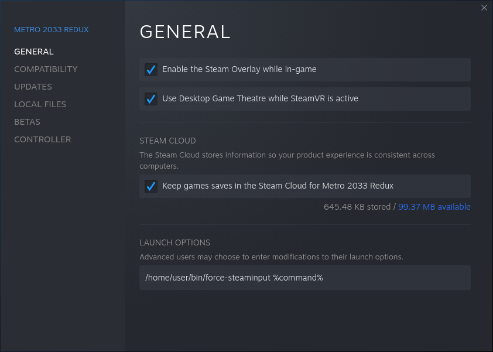

# force-steaminput

While most ports to Linux are really well made, sometimes there are some issues with some game controllers, especially if you don't want to use the ubiquitous Xbox game controller. I came across this issue when I wanted to play Metro 2033 and after some debugging I wrote this small helper that I want to share here.

# Scope

My helper tool is meant to help with SDL games that ignore the Steam setting of forcing the game into "Steam Input" mode. It provides an alternative way to make such games work well with "non Xbox game controllers" without too much fiddling involved.

# Setup

- Check out this repository (or download a snapshot archive and extract it)
- Place the "force-steaminput" script wherever you want in your system.
- Right click the game in your Steam inventory and choose "Properties" from the context menu
- Enter the full path to "force-steaminput" to the "game launch options" followed by one "space character" and `%command%`

# Usage

- Make sure your game controller is connected and properly recognized by the system
- Launch game

# What it does

Actually "Steam Input" is based around a "virtual Xbox controller" which is emulated by Steam itself. If you enable "Steam Input" for a game, then Steam exports an environment variable

    SDL_GAMECONTROLLER_IGNORE_DEVICES_EXCEPT=0x28DE/0x0000,

This should make the game ignore all game controllers attached to the system except the one emulated by Steam.
The problem seems to be that some games, for whatever reason, ignore this environment variable completely and still enumerate and use all available game controllers. With my PS4 controller this created a funny behavior where each button seems to have two or more functions. Probably because the "virtual Xbox controller" and the (not properly know to the game) PS4 controller both were used by the game at the same time.

My script goes a different route and enumerates all input controllers, hooked to the system, to find the device name of the "virtual Xbox controller". Then it forces the game to use it by using the

    SDL_JOYSTICK_DEVICE

environment variable. And at least for Metro 2033 this variable is properly recognized which forces Metro 2033 into Steam Input mode.
